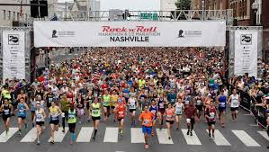

# Music City Marathons Webscraping Project


Nashville Rock-and-Roll Marathon was used in a prior lesson at when learning Excel. In this new project we used webscraping to obtain the data, and were given a brief time to work with the scrapted data in Python.  

To approach this, my goal was to try and recreate the same chart I had created in Excel. I was unable to accomplish this in the brief time alotted for EDA (3 hours), but learned a lot in the process!

<b> What I Learned </b>
- I was successful in:
    - Importing csv files that I had scraped using BeautifulSoup, using Pandas to convert to datetime, then to timedelta
    - Wrote thorough pseudo-code at beginning of second eda notebook
    - Dropped all rows of runners who didn't finish (with Time as 00:00:00)
    - Other basic EDA functions
- Time column was dtype object. Wanted to get average. Converted to datetime, but later figured out it needed to be something else (possible timedelta, or integer)
- I knew there was an outlier - a half-marathon runner was put into the full marathon race. 
    - Tried via scatter plot - again, object and datetime didn't work. Learned that I needed to use Seaborn.
    - Tried via boxplot as well. Was out of time by that point.


### <b>Chart from earlier Excel project - "Music City Marathons Presentation"</b>


<br>

<br>

# <b>Class Readme instructions</b>

The data for the Nashville Rock-and-Roll Marathon that you worked with in Excel was scraped from the `www.runrockroll.com` race results page. Now it's **your turn** to scrape the data from the website! The number of pages of results *for each race* and the base URL that you will build out is provided below.

#### Pagination values (found using postman) and base urls for 4 years of Marathon and 1/2 Marathon results 

```
Number of pages of results

pgs_2016 = 154
pgs_2017 = 147
pgs_2018 = 85
pgs_2019 = 113
pgs_half_2016 = 898
pgs_half_2017 = 892
pgs_half_2018 = 598
pgs_half_2019 = 690
```  

```
Base URLs for each race results page

urlbase_2019 = 'https://www.runrocknroll.com/Events/Nashville/The-Races/Marathon/2019-Results?gender=&agegroup=&bib=&firstname=&lastname=&page='
urlbase_2018 = 'https://www.runrocknroll.com/Events/Nashville/The-Races/Marathon/2018-Results?gender=&agegroup=&bib=&firstname=&lastname=&page='
urlbase_2017 = 'https://www.runrocknroll.com/Events/Nashville/The-Races/Marathon/2017-Results?gender=&agegroup=&bib=&firstname=&lastname=&page='
urlbase_2016 = 'https://www.runrocknroll.com/Events/Nashville/The-Races/Marathon/2016-Results?gender=&agegroup=&bib=&firstname=&lastname=&page='
urlbase_half_2019 = 'https://www.runrocknroll.com/Events/Nashville/The-Races/Half-Marathon/2019-Results?gender=&agegroup=&bib=&firstname=&lastname=&page='
urlbase_half_2018 = 'https://www.runrocknroll.com/Events/Nashville/The-Races/Half-Marathon/2018-Results?gender=&agegroup=&bib=&firstname=&lastname=&page='
urlbase_half_2017 = 'https://www.runrocknroll.com/Events/Nashville/The-Races/Half-Marathon/2017-Results?gender=&agegroup=&bib=&firstname=&lastname=&page='
urlbase_half_2016 = 'https://www.runrocknroll.com/Events/Nashville/The-Races/Half-Marathon/2016-Results?gender=&agegroup=&bib=&firstname=&lastname=&page='
```  


**After loading the marathon and half-marathon data to DataFrames in Python, perform EDA as usual. Think of a question that you find interesting and answer it by exploring the data. Prepare a brief (5 minutes) presentation to share what you find.**


